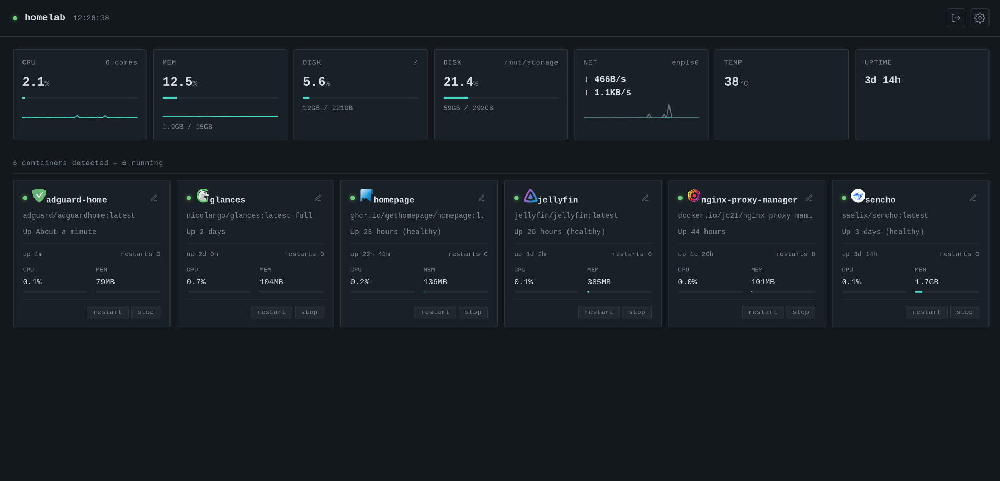

# Pinnule

Current version 1.4.1

**A nimble, lightweight dashboard for your homelab.**

Pinnule is a lightweight front-facing portal that sits on top of your local infrastructure and gives you a clean, real-time view of your Docker containers and host hardware.

It automatically discovers running containers, displays system statistics, and provides quick access to your applications — with minimal configuration.



> **Built entirely through vibe coding with multiple AI agents.**

---

## 🔐 Login

Pinnule is gated behind a seld-signed certificate and a single local admin account.

* **First run**: opening Pinnule for the first time shows a setup screen — pick a username and password (min. 8 characters) and confirm the password. That becomes the one account for the dashboard. Right after, you'll be shown a **recovery code** once — save it somewhere safe, it's the only way back in if you forget your password.
* **After that**: you'll see a normal login screen. A "keep me signed in on this device" checkbox controls session length — checked gives you a 30-day session that renews with activity; unchecked gives a short 8-hour session, useful for a shared or kiosk-style screen you don't want to stay logged into.
* **Forgot your password?** Use the "forgot password?" link on the login screen with your username and recovery code to set a new password. Using the code rotates it — you'll be shown a fresh one to save afterwards.
* Once signed in, the gear menu has a **security** section to change your password or generate a new recovery code (both require your current password).
* Credentials are stored as a bcrypt hash in `auth.json` on the `pinnule_data` volume (see [Persistent application data](#persistent-application-data)) — never in plain text, never in the image, never in git. The recovery code is stored the same way — only its hash is kept.
* There's a logout button (next to the gear icon) once you're signed in.

If you ever lose both your password and your recovery code, the account can only be reset by removing `auth.json` from the data volume (`docker exec -it pinnule rm /app/data/auth.json`), which clears the account entirely and shows the setup screen again on next load.

## ✨ Features

### 🐳 Automatic container discovery

Pinnule talks directly to the Docker socket using [`dockerode`](https://github.com/apocas/dockerode).

There is **no app configuration file** and no need to manually list your containers.

For each container Pinnule can display:

* Container name
* Docker image
* Running/stopped status
* CPU usage
* Memory usage
* Runtime information
* Creation time
* Docker restart count

Anything running on the Docker host can automatically appear on the dashboard.

---

### 🖥️ Hardware monitoring

Pinnule provides a configurable overview of the host system, including:

* CPU load
* Memory usage
* Disk usage
* Network throughput
* Temperature
* System uptime

The hardware panels can be enabled or disabled from the **Settings** drawer using the gear icon.

The polling interval is also configurable.

Your preferences are stored in the browser using `localStorage`, so they persist between page reloads.

### App links and icons

Pinnule automatically discovers Docker containers and creates an app link from the first published container port it finds.

You can also provide explicit links using Docker labels:

```yaml
labels:
  pinnule.url: "https://example.local"
  pinnule.icon: "https://example.local/icon.png"
```

If no custom icon is supplied, Pinnule falls back to the [Selfh.st Icons](https://selfh.st/icons/) collection using the container name.

#### Custom container links

Container links can be changed directly from the dashboard by clicking the **pencil icon** next to a container's link.

Custom links are stored **server-side** rather than in the browser. This means your customised links are available regardless of:

* Browser
* Device
* Private/incognito window
* Browser cache or local storage

Pinnule stores these overrides in:

```text
/app/data/url-overrides.json
```

The API provides endpoints for managing custom links:

```text
PUT    /api/containers/:name/url
DELETE /api/containers/:name/url
```

`PUT` saves a custom URL for a container.

`DELETE` removes the custom URL and returns the container to its automatically detected URL.

The container API exposes three URL-related values:

* `appUrl` — the final URL Pinnule should use
* `autoUrl` — the automatically detected or Docker-label URL
* `urlOverridden` — whether a custom URL is currently being used

### Persistent application data

Pinnule uses a Docker named volume for application data:

```yaml
volumes:
  - pinnule_data:/app/data
```

The volume stores server-side configuration such as custom container URL overrides, plus the login account (`auth.json` — bcrypt-hashed password and recovery code) and the session signing secret (`session-secret.txt`).

Because the data is stored in a Docker volume, custom links survive:

* Container restarts
* Image updates
* Container rebuilds
* Docker Compose redeployments

The data will remain available as long as the `pinnule_data` Docker volume is retained.


### Docker labels

You can override the automatic behaviour with optional Docker labels:

```yaml
labels:
  - pinnule.url=http://192.168.1.230:8080
  - pinnule.icon=https://example.com/icon.png
```

#### `pinnule.url`

Overrides the automatically detected application URL.

#### `pinnule.icon`

Provides a custom icon URL.

If no icon is specified, Pinnule automatically attempts to find a matching icon from the [Selfh.st Icons](https://selfh.st/icons/) collection.

If an icon cannot be found, it is hidden cleanly rather than leaving a broken-image placeholder.

---

## 🎮 Controlling containers

Each container card includes a stop/start and restart control.

### Start

Starting a container happens immediately.

### Stop / Restart

Stopping and restarting a container requires confirmation because it can interrupt a running application.

The container name itself is also clickable when an application URL can be determined.

---

## 📦 Deployment

Pinnule is designed to be simple to deploy using Docker Compose.

### Create the Compose file

Create a directory for Pinnule:

```bash
mkdir -p ~/pinnule
cd ~/pinnule
```

Create `docker-compose.yml`:

```yaml
services:
  pinnule:
    image: ghcr.io/nikon1977/pinnule:latest
    container_name: pinnule
    restart: unless-stopped
    network_mode: host   # needed for real network stats; ports: mapping still works for disk detection alone
    volumes:
      - /var/run/docker.sock:/var/run/docker.sock:ro
      - pinnule_data:/app/data
      - type: bind
        source: /
        target: /hostfs
        read_only: true
        bind:
          propagation: rslave

volumes:
  pinnule_data:
```

### Start Pinnule

```bash
docker compose up -d
```

Docker will automatically pull the latest Pinnule image from GitHub Container Registry.

Once the container has started, open:

```text
https://SERVER-IP:4443
```

For example:

```text
https://192.168.1.230:4443
```

Pinnule serves itself over HTTPS with a self-signed certificate it generates on first run (and reuses on every restart after that, so your browser's "trust this certificate" exception keeps working). Your browser will warn that the certificate isn't from a recognized authority the first time you connect — that's expected for a self-signed cert on a LAN-only app; proceed past the warning the same way you would for any other self-signed service on your network.

The old plain-HTTP address (`http://SERVER-IP:4000`) still works, but only redirects to the HTTPS address above — it no longer serves the app directly, so your login password is never sent unencrypted.

### Updating Pinnule

To update to the latest published version:

```bash
docker compose pull
docker compose up -d
```

Your custom container links are stored in the `pinnule_data` Docker volume, so they persist when Pinnule is updated or recreated.

### Using a specific version

Pinnule releases can also be pinned to a specific version instead of using `latest`:

```yaml
image: ghcr.io/nikon1977/pinnule:1.1.0
```

This allows you to stay on a known version until you are ready to upgrade.


## 🌐 Why host networking?

Pinnule uses:

```yaml
network_mode: host
```

rather than a Docker `ports:` mapping.

This is important for the network monitoring functionality.

With normal Docker networking, Pinnule would see the container's virtual network interface rather than the host's actual network traffic.

Host networking allows Pinnule to see the real network interface and therefore report meaningful network throughput.

### The trade-off

Pinnule binds directly to port `4443` (HTTPS) and `4000` (HTTP, redirect-only) on the Docker host.

Make sure other applications aren't already using those ports.

---

## 💾 Disk detection

The **DISK** panel displays:

* The main `/` filesystem
* Filesystems mounted under `/mnt/`

Other mounts such as:

* `/boot`
* `/boot/efi`
* Docker overlay filesystems
* Other internal mounts

are intentionally filtered out.

The goal is to show the disks and mounts that are actually useful to a homelab user.

This relies on `rslave` mount propagation in `docker-compose.yml`.

Without it, Pinnule may only see the root filesystem and not additional drives mounted beneath `/mnt/`.

If a drive still doesn't appear after rebuilding Pinnule, check the host with:

```bash
mount
```

---

## 🔒 Why `/:/hostfs:ro`?

Pinnule needs access to some information from the Docker host.

CPU, memory and uptime information comes from:

```text
/proc
/sys
```

Docker already exposes these areas sufficiently for Pinnule to read the host's statistics.

Disk usage is different.

Without access to the host filesystem, Pinnule would see the container's own Docker overlay filesystem instead of the actual host disks.

The solution is to mount the host filesystem read-only:

```text
/:/hostfs:ro
```

This allows Pinnule to inspect the host filesystem without giving it write access.

**Nothing inside the container can write to the host through this mount.**

---

## 🌡️ If TEMP shows `n/a`

Temperature monitoring depends on what sensors your hardware and kernel expose through:

```text
/sys/class/thermal
```

Some systems simply don't expose usable temperature information there.

If temperature remains unavailable, you can either:

1. Disable the TEMP panel in Pinnule's settings, or
2. Install `lm-sensors` on the host and check whether additional sensors become available.

This is harmless and does not affect the rest of Pinnule.

---

## 🛠️ Extending Pinnule

The project is intentionally simple and easy to modify.

### `server.js`

Provides the backend API:

```text
/api/containers
/api/system
```

Add new backend information here first.

### `public/app.js`

Polls the API and updates the dashboard.

### `public/style.css`

Contains the dashboard styling.

CSS custom properties are located near the top of the file, making it easy to change the theme.

---

## 🤖 Development

Pinnule was built using a **vibe-coding workflow with multiple AI agents**.

The project is intentionally kept relatively small and straightforward so that it remains easy to understand, modify and experiment with.

There is still plenty I'd like to add.

---

## 📋 Roadmap

Pinnule is already functional, but there is plenty of room for improvement.

Some areas I'd like to explore:

* Better application URL detection
* More container controls
* Additional hardware metrics
* More detailed network information
* Improved application discovery
* More dashboard customisation
* More configuration options

---

## 📄 License

Pinnule is released under the **MIT License**.

See [`LICENSE`](LICENSE) for the full license text.

---

## 👤 Author

Created by **nikon1977**.

GitHub:
https://github.com/nikon1977

---

## ⭐ If you find Pinnule useful

If Pinnule is useful in your homelab, consider giving the project a ⭐ on GitHub.

Feedback, ideas and contributions are welcome.
