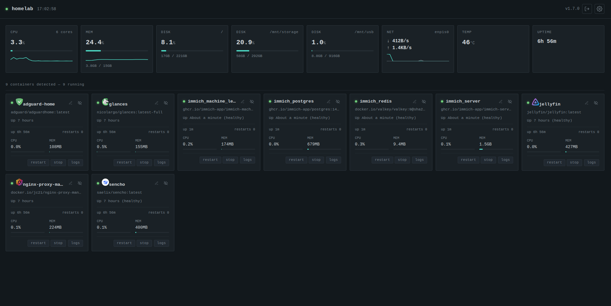
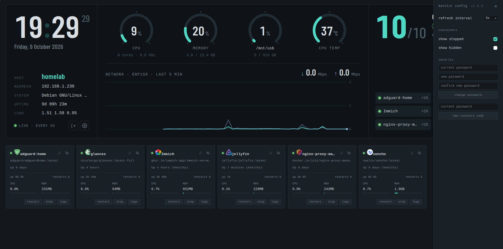
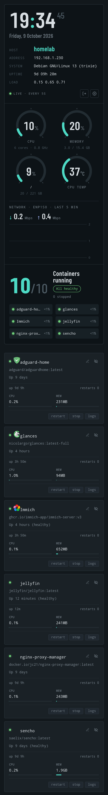

# Pinnule

Current version 1.8.0

**A nimble, lightweight dashboard for your homelab.**

Pinnule is a lightweight front-facing portal that sits on top of your local infrastructure and gives you a clean, real-time view of your Docker containers and host hardware.

It automatically discovers running containers, displays system statistics, and provides quick access to your applications — with minimal configuration.

<table>
  <tr>
    <td align="center">
       
      Dashboard
    </td>
    <td align="center">
       
      Dashboard Menu
    </td>
    <td align="center">
       
      Mobile View
    </td>
  </tr>
</table>

To be re-written
